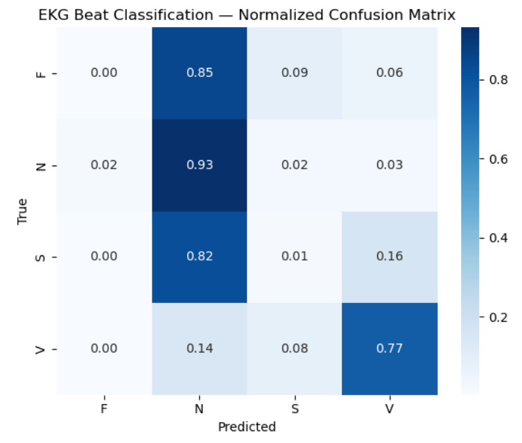
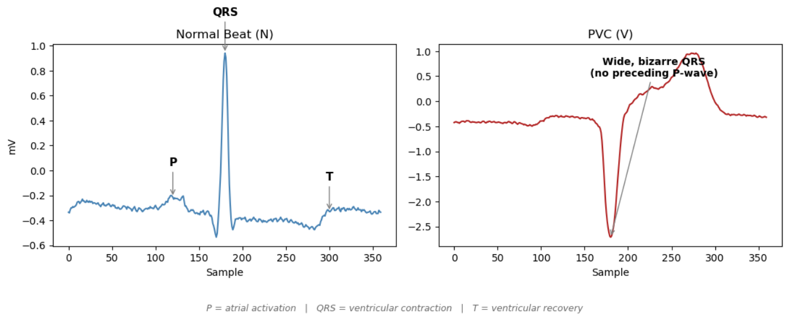

# ekg-arrhythmia-classifier-cnn.ipynb
1D CNN classifying EKG beats as normal/PVC/etc. from the MIT-BIH Arrhythmia Database


# EKG Arrhythmia Classifier (CNN)

A small 1D convolutional neural network that classifies individual heartbeats from ECG signal as normal or one of three arrhythmia types, using the MIT-BIH Arrhythmia Database.

This is the 4th project in a series exploring applied ML on medical data ([PCam](#) · [ICH](#) · [DNA methylation classifier](#)).

## Problem

Given a short window of raw ECG signal centered on a single heartbeat, classify it into one of four categories:

- **N** — Normal beat
- **S** — Supraventricular ectopic beat (e.g. atrial premature beat)
- **V** — Ventricular ectopic beat (e.g. PVC)
- **F** — Fusion beat

Beat-level ground truth comes from the MIT-BIH Arrhythmia Database's existing cardiologist annotations — no manual labeling was performed.

## Data

- **Source:** [MIT-BIH Arrhythmia Database](https://physionet.org/content/mitdb/1.0.0/), via the `wfdb` Python package
- **Signal:** MLII lead, 360Hz, one 1-second window (360 samples) centered on each annotated beat
- **Class grouping:** raw beat annotations mapped to the standard [AAMI EC57](https://www.aami.org/) 5-class scheme (N/S/V/F/Q); the Q class (paced/unclassifiable beats) was dropped after dataset exclusions left it with too few examples to evaluate meaningfully — final problem is 4-class (N/S/V/F)
- **Train/test split:** standard patient-level DS1/DS2 split used in published MIT-BIH benchmarks, with 4 conventionally-excluded paced-beat-dominated records (102, 104, 107, 217) removed

## Model

A small 1D CNN — 3 convolution/pooling blocks, global average pooling, one dense hidden layer:

- ~11K trainable parameters
- Class-weighted training (`sklearn.utils.class_weight`, balanced) to counter the heavy natural imbalance toward normal beats
- Early stopping on validation loss, restoring the best checkpoint rather than the final epoch

## Results

| Class | Precision | Recall |
|---|---|---|
| N | 0.95 | 0.93 |
| V | 0.62 | 0.77 |
| S | 0.02 | 0.01 |
| F | 0.00 | 0.00 |

The model learns normal beats and ventricular ectopic beats (PVCs) well — both have distinctive QRS shapes that a CNN operating on raw waveform windows can pick up. It essentially fails on supraventricular (S) and fusion (F) beats.

**Why, not just that:** S-class beats (like atrial premature contractions) are often defined more by early timing and P-wave morphology than by QRS shape — the QRS itself can look near-normal. A model trained on isolated beat windows, without relative timing (R-R interval) as an input feature, has no real way to learn this distinction. F-class beats are both extremely rare in the training data and, by definition, a blend of two other classes — a genuinely hard boundary to learn even with more data. Both limitations are inherent to the intentionally simple feature set used here, not implementation bugs.



## Example: Normal Beat vs. PVC



## Limitations / possible extensions

- No R-R interval or inter-beat timing feature — would likely be necessary to meaningfully improve S-class performance
- F class has too few examples in this dataset to expect strong performance from any model without oversampling or synthetic data
- A sequence/transformer-based approach was considered but not pursued, given the core bottleneck here is missing input features rather than model capacity

## Reproducing

```bash
pip install -r requirements.txt
jupyter notebook ekg-arrhythmia-classifier-cnn.ipynb
```

Run all cells top to bottom. Data is streamed directly from PhysioNet via `wfdb` — no manual download required
